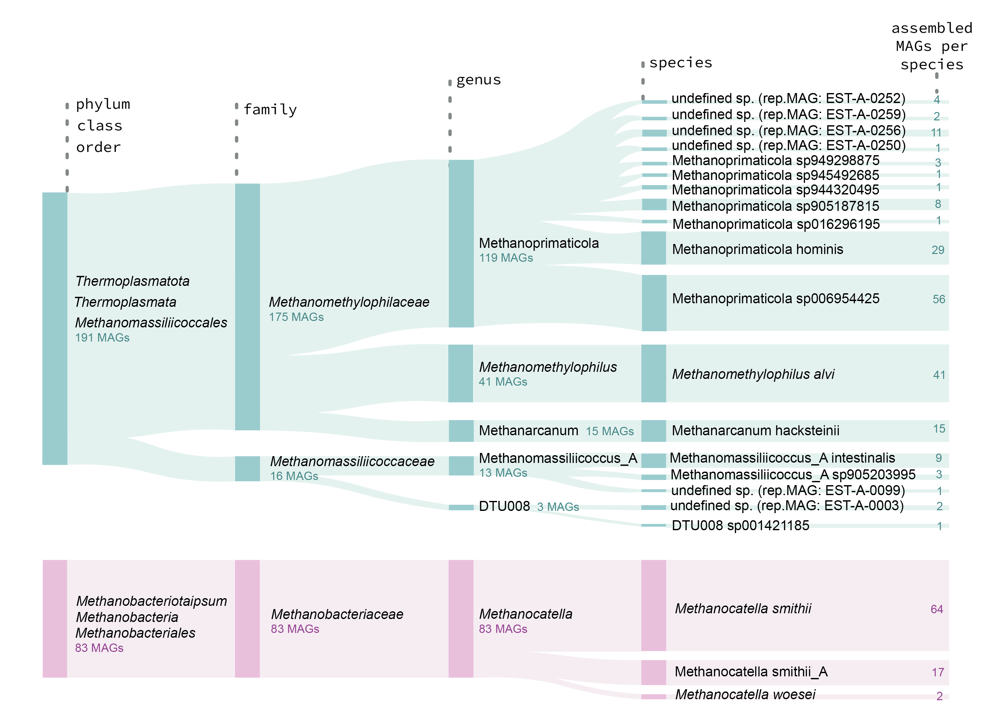

# PROJECT: Human gut archaea collection from Estonian population

✨ Motivation: The aim of this project is to explore the archaeal diversity within the Estonian population. The final EstMB MAGdb Archaea-273 collection comprises 144 strains representing 21 archaeal species.

## Data availible for download here

- Paper draft: [Download link](https://www.biorxiv.org/content/10.1101/2024.07.06.602324v1.full)
- EstMB MAGdb Archaea-273 collection: [Download link](https://www.ebi.ac.uk/ena/browser/view/PRJEB81541)
- Functional profiling results: [Download link](https://figshare.com/articles/dataset/Prokka_annotation/29329166)

## Scriprs

Raw data processing on cluster:

- Reads_preprocessing_RemoveHost.sh
- Reads_preprocessing_RemoveLQ.sh
- MAG_assembly.sh
- MAG_binning.sh
- MAG_clustering.sh
- Taxanomic_annotation.sh
- MAGs_quality.sh
- Phylogenetic_analysis.sh
- Prevalence_and_abundance.sh
- Functional_annotation.sh

Data analysis notebooks:

- Script <b>Archaea_main</b> Main analysys for the paper.
- Script <b>Archaea_QC</b> Addtional quality checks.
